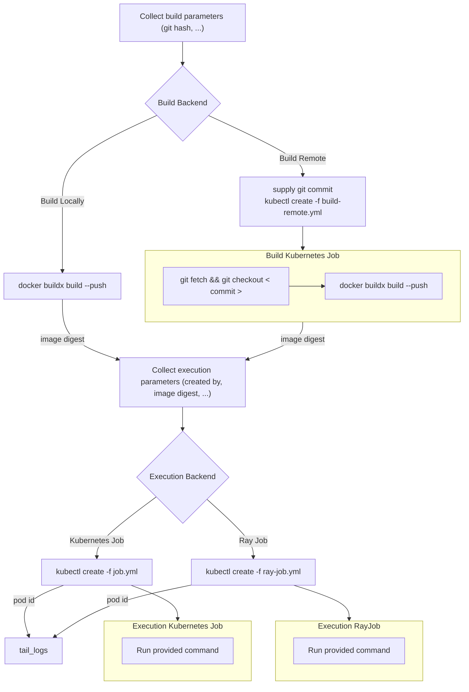

## Job Submission

The overall process of job submission is described in the following diagram.

### Design Decisions

#### Should the build job initiate the execution job?

No, we will pull these apart which makes it easier to forward errors to the user and separates responsibility.

#### What should the build job output?

The resulting container image name and digest. Maybe also the registry url, but that url may be different inside/outside the kubernetes cluster.

#### How do we supply credentials?

The execution backends as of now support mounting kubernetes secrets as volumes. We can use that to add secrets from the job submission's machine into the worker pods.

#### Should we require a clean git working directory?

By default we should probably check that:

- the working directory is clean
- the current commit is available on the remote

We can then include the git commit hash.

We should consider allowing the user to opt out through a flag or something like `--allow-dirty`.

#### How do we specify the number of GPUs for the entry point, the number of workers, etc?

- `--builder <docker|kaniko> default: docker` to specify the build backend.
- `--workers <N> where N >= 1 default 1` to specify the number of workers.
- `--workers <N> where N >= 1 default 1` to specify the execution backend, when `workers == 1` we use kubernetes Jobs, otherwise when `workers >= 2` we use RayJobs.
- `--cpus <N> where N >= 0 default 0` to specify the number of cpus per worker.
- `--gpus <N> where N >= 0 default 0` to specify the number of gpus per worker.

|               | entrypoint               | worker                                         |
| ------------- | ------------------------ | ---------------------------------------------- |
| assigned CPUs | hardcoded as the default | supplied by user through `--cpus <N>` argument |
| required CPUs | hardcoded as 0           | supplied by user through annotations in python |
| assigned GPUs | hardcoded as 0           | supplied by user through `--gpus <N>` argument |
| required GPUs | hardcoded as 0           | supplied by user through annotations in python |

#### Should RayJob entrypoints run on the head node or a worker?

By default the entrypoint is executed on the head node.
This [can be changed](https://docs.ray.io/en/latest/cluster/faq.html#where-does-my-ray-job-entrypoint-script-run-on-the-head-node-or-worker-nodes) by requesting resources for the entrypoint.
For large clusters, [the advice](https://docs.ray.io/en/latest/cluster/vms/user-guides/large-cluster-best-practices.html#configuring-the-head-node) is to set `num_cpus` in the ray cluster spec to `0` and setting the required CPUs for the ray entrypoint to something larger than `0`.

We will not do this initially and just run the entrypoints on the head node because we spawn a cluster for each job with its own head node.

If we do ever run the entrypoint on the worker, we need to make sure that ray workers can run multiple jobs concurrently.
Otherwise if the entrypoint is waiting on some other tasks, but those tasks can not execute on the entrypoint's worker, we are claiming cluster resources that we do not use efficiently.
[This discussion](https://discuss.ray.io/t/jobs-with-fractional-gpu-usage-are-not-spread-across-gpus-evenly/7799/4) suggests that Ray workers can run jobs concurrently, but we should find more convincing evidence.

#### Should we support spawning multiple workers for the kubernetes execution backend?

Might be useful, the question is how do we tail the logs of multiple workers, just the first one, all mixed together, none by default?

#### How do we mitigate claimed but unused resources?

A Job or RayJob can always claim resources and not use them.
We could try to detect this, but it probably is not necessary at the beginning.

RayJob workers in particular can easily claim more resources than are being used, because the number of workers and their resources are provisioned regardless of whether work actually gets scheduled on those workers.
We can enable auto scaling to mitigate that.
