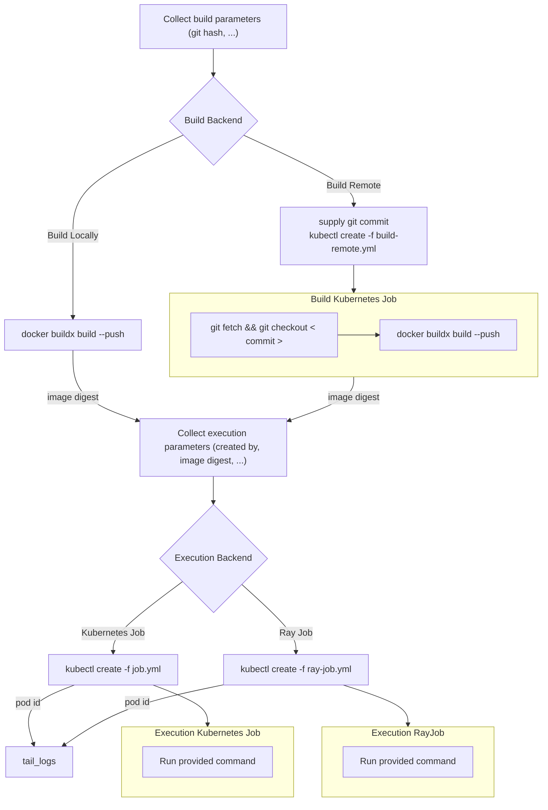

## Job Submission

The overall process of job submission is described in the following diagram.

### Design Decisions

#### Should the build job initiate the execution job?

No, we will pull these apart which makes it easier to forward errors to the user and separates responsibility.

#### What should the build job output?

The resulting container image name and digest. Maybe also the registry url, but that url may be different inside/outside the kubernetes cluster.

#### How do we supply credentials?

The execution backends as of now support mounting kubernetes secrets as volumes. We can use that to add secrets from the job submission's machine into the worker pods.

#### Should we require a clean git working directory?

By default we should probably check that:

- the working directory is clean
- the current commit is available on the remote

We can then include the git commit hash.

We should consider allowing the user to opt out through a flag or something like `--allow-dirty`.

#### How do we specify the number of GPUs for the entry point, the number of workers, etc?

- `--build <local|remote> default: remote` to specify the build backend.
- `--execution <kubernetes|ray> default: kubernetes` to specify the execution backend.
- `--workers <N> where N >= 1 default 1` to specify the number of workers.
- `--gpus <N> where N >= 0 default 0` to specify the number of gpus per worker.

Jobs can end up not utilizing all requested GPUs. For RayJobs, we can enable auto scaling to mitigate that somewhat.

#### Should we support spawning multiple workers for the kubernetes execution backend?

Might be useful, the question is how do we tail the logs of multiple workers, just the first one, all mixed together, none by default?
